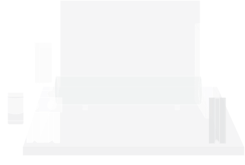

<!--
{:#mouse}{:.path}
{:#box}{:.path}
{:#pc}{:.path}

# R A I L {#title}
### The **R**odent **A**utomated and **I**ntegrated **L**earning platform {#subtitle}

<a href="https://github.com/badholt/rail" class="button">

View on GitHub
</a>

<a href="https://mysorelab.johnshopkins.edu/" class="button">

Mysore Lab
</a>

-->